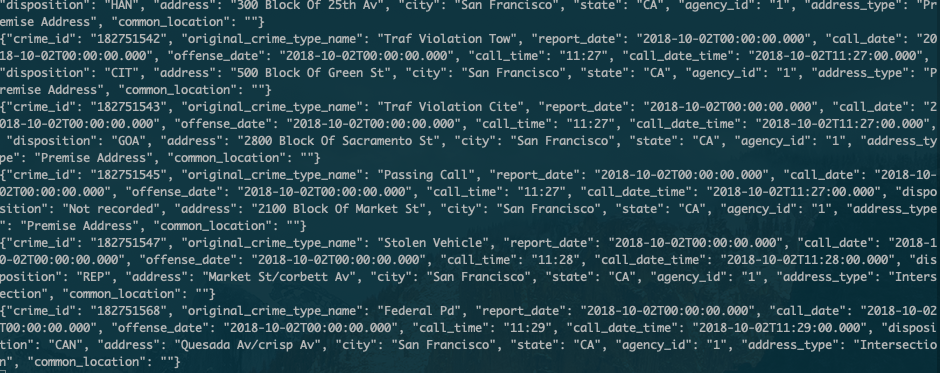
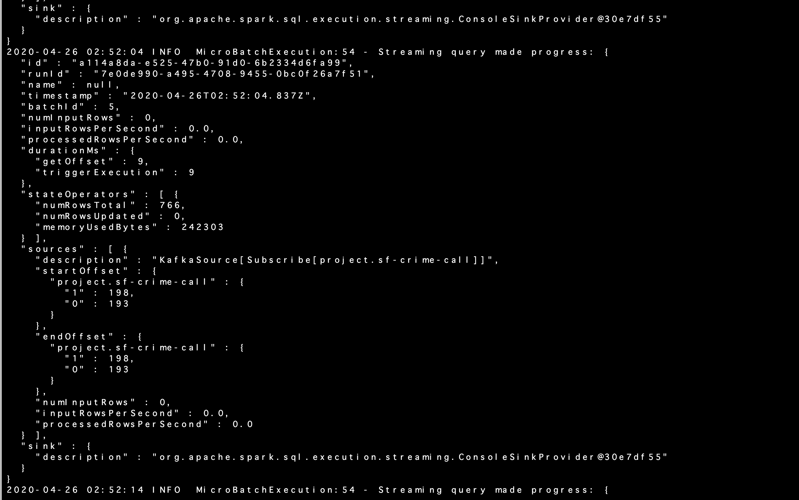
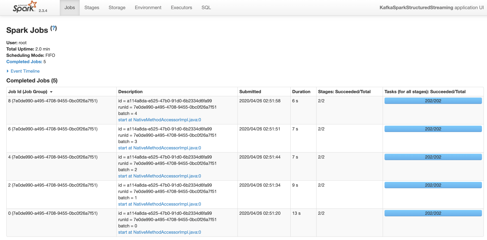

# SF Crime Statistics with Spark Streaming

In this project, an example of spark streaming analysis is presented.
As a data source, real-world dataset, extracted from Kaggle, on San Francisco crime incidents is used.
Apache kafka is used as a data broker. 
A producer service reads each incident from the json file and gives message to the kafka's broker service.
Spark consume the structured streaming data produced by the producer service.

## Development Environment

To examine this project, the following environment is needed.

- Spark 2.4.3
- Scala 2.11.x
- Java 1.8.x
- Kafka build with Scala 2.11.x
- Python 3.6.x or 3.7.x

In a setup, you may need to set the following environment variables.
The detail of the path should differ depending on how you installed the dependencies.

```
export SPARK_HOME=/Users/dev/spark-2.4.3-bin-hadoop2.7
export JAVA_HOME=/Library/Java/JavaVirtualMachines/jdk1.8.0_181.jdk/Contents/Home
export SCALA_HOME=/usr/local/scala/
export PATH=$JAVA_HOME/bin:$SPARK_HOME/bin:$SCALA_HOME/bin:$PATH
```


## Problems and Solutions

### step 1

#### problem

Take a screenshot of your kafka-consumer-console output. 

#### solution



### step 2

#### problem

Take a screenshot of your progress reporter after executing a Spark job.

#### solution



#### problem

Take a screenshot of the Spark Streaming UI as the streaming continues. 

#### solution

Note. Since this project use structured streaming, the Spark Streaming UI tab does not appear.

cf. https://knowledge.udacity.com/questions/86980



### step 3

1. How did changing values on the SparkSession property parameters affect the throughput and latency of the data?

*Ans.*

- spark.executor.memory will affect the executor performance and allowing larger memory increases throughput. 
- spark.driver.memory will affect how many data the driver can process and allowing larger memory increase throughput.
- spark.executor.cores will affect the number of core used executor and setting larger number improves latency.
- spark.streaming.blockInterval: will affect the number of tasks and setting smaller interval increases the number of tasks. 
- 
cf. https://spark.apache.org/docs/latest/configuration.html#spark-streaming

2. What were the 2-3 most efficient SparkSession property key/value pairs? Through testing multiple variations on values, how can you tell these were the most optimal?

*Ans.*
I changed some parameters described above and examined `processedRowsPerSecond` in MicroBatchExecutor Report. But I could not observe any difference. 

 - spark.executor.memory: 1g - 512m
 - spark.driver.memory: 1g - 512m
 - spark.executor.cores: 1 - 2
 - spark.streaming.blockInterval: 50ms - 500ms
 